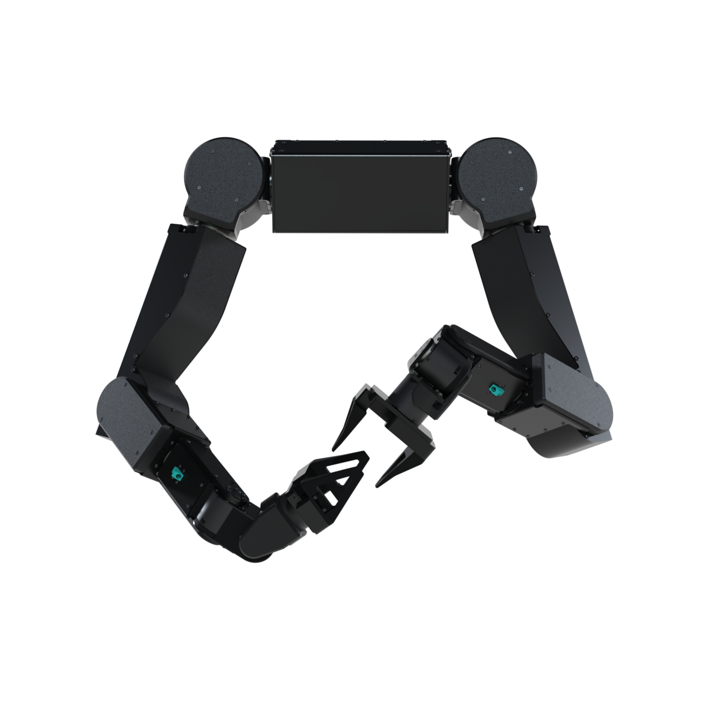

# Almond Axol SDK



Command-line interface and Python SDK for the Almond Axol dual-arm robot. CLI invoked as `axol <command> [flags]`.

The browser front-ends live under [`web/`](web/): a **VR teleoperation interface** (WebXR, hosted at [axol.almond.bot](https://axol.almond.bot)) and a **web control panel** that drives the robot from a browser via `axol serve`. See [`web/README.md`](web/README.md) for the front-end details.

The full documentation is hosted at [docs.almond.bot](https://docs.almond.bot). The sources live under [`docs/`](docs/), and the pages below link to them.

**New here?** See [Teleoperation](https://docs.almond.bot/operations/teleop) to go from installation to a live session, or the [Web Control Panel guide](https://docs.almond.bot/guides/control-panel) to drive Axol from a browser.

## Requirements

- **Linux**
- **Python 3.13+**
- **(Optional) NVIDIA Jetson** (e.g. a ZED Box) — required for the GMSL-attached ZED cameras (data collection / policy inference).

## Installation

### One-command install (recommended)

One command installs `uv`, the `axol` CLI (from GitHub, with every extra except `cuda`), and a root systemd service that keeps `axol serve` running at boot:

```bash
curl https://axol.almond.bot/install -fsS | bash
```

Then open [axol.almond.bot](https://axol.almond.bot) and connect to the machine. The install keeps itself in sync with `main`: when the control panel connects, the server upgrades in the background and restarts onto the new version once idle.

### Development install

Install the package from a clone using [`uv`](https://docs.astral.sh/uv/). `pyroki` and `lerobot` are sourced from Git and are resolved automatically:

```bash
uv sync
```

Then activate the virtual environment so the `axol` CLI is on your path (or prefix every command with `uv run`):

```bash
source .venv/bin/activate
```

Install optional dependency groups as needed:

| Extra | Contents | When to use |
|---|---|---|
| `lerobot` | LeRobot (from GitHub) | `collect-data`, `run-policy` |
| `sim` | viser | `teleop --sim` |
| `cuda` | JAX with CUDA 13 support | GPU-accelerated JAX (IK solver used by `teleop`); note that CPU is usually faster for the JAX IK solver |

```bash
uv sync --extra lerobot --extra sim          # teleoperation + data collection
uv sync --extra lerobot --extra cuda         # policy execution on GPU
uv sync --extra lerobot --extra sim --extra cuda   # everything
```

The ZED Python bindings (`pyzed`) are not on PyPI and must be installed separately after the ZED SDK is installed:

```bash
axol zed.install
```

Streaming the ZED cameras to the headset (`teleop --cameras`, `collect-data`) encodes on the Jetson's NVENC via GStreamer and sends over WebRTC with aiortc. The encode path needs the system GStreamer NVENC tools plus the patched ZED source plugins, so it isn't a dependency extra. Install it once (and, on a Jetson, pin the NVENC/VIC clocks for low-latency encode):

```bash
axol gst.install
axol gst.build-zed   # build the patched ZED source plugins (needs the ZED SDK)
axol jetson.setup    # Jetson only; no-op elsewhere
```

Before using any motor or robot commands, initialize the CAN hardware:

```bash
axol can.setup
```

To drive Axol from a browser instead of the terminal, build the web UI once (it's served by `axol serve`):

```bash
cd web
npm install
npm run build --workspace=packages/axol-vr-client   # client package first
npm run build --workspace=app                        # → web/app/dist
```

See the [installation guide](https://docs.almond.bot/installation) for the full walkthrough.

## Sitemap

### Get Started

- [Overview](https://docs.almond.bot)
- [Installation](https://docs.almond.bot/installation)

### Operations

Each operation can be driven from the web control panel or the CLI:

- [Teleoperation](https://docs.almond.bot/operations/teleop) — drive the robot live from a VR headset (or in sim)
- [Gravity Compensation](https://docs.almond.bot/operations/gravity-comp) — hold the arms weightless for hand-guiding
- [Data Collection](https://docs.almond.bot/operations/data-collection) — record teleop episodes to a LeRobot dataset
- [Run Policy](https://docs.almond.bot/operations/run-policy) — run a trained policy, local or remote inference

### Remote Teleop

- [Remote Teleop](https://docs.almond.bot/guides/remote-teleop) — drive over the internet by sideloading Tailscale on a Meta Quest

### Quest over USB

For the lowest-latency controller link, stream the Quest's controller poses over a USB cable instead of WiFi — WiFi power-save buffering otherwise adds ~150 ms gaps between pose updates. Camera video still streams over the LAN (WebRTC can't cross the USB tunnel), so you connect to the robot's IP as usual and just tick a box for USB poses.

**One-time headset setup**

1. Enable **Developer Mode**: in the Meta Horizon phone app, open *Menu → Devices →* your headset *→ Headset Settings → Developer Mode* and toggle it on (needs a free Meta developer account), then reboot the headset.
2. Plug the headset into the robot host with a data-capable USB-C cable. `adb` and the Oculus udev rule are installed by `axol provision` (run by the installer), so nothing else is needed on the robot.

**Each session**

1. In the web control panel (`axol serve`), the **Quest USB** tile shows the headset state. The first time, accept the *Allow USB debugging?* prompt on the headset (check "Always allow"). Once authorized the tunnel comes up automatically (`adb reverse tcp:8000 tcp:8000`) and the tile turns green ("Controller over USB"); the **Connect** button is a manual fallback / reconnect.
2. In the VR app, enter the robot's host/IP as usual and tick **Quest over USB** before connecting. The first time, tap **Authorize USB certificate** (accepts the self-signed cert for `localhost`, a separate origin from the host cert). Controller poses then ride the cable while camera video uses the LAN.

If the tile shows `unauthorized`, re-accept the prompt on the headset; if it shows no device, replug the cable and confirm Developer Mode is on.

### Web Interfaces

- [Web Control Panel](https://docs.almond.bot/guides/control-panel) — drive the robot from a browser via `axol serve`
- [VR Interface](https://docs.almond.bot/guides/vr-interface) — the in-repo WebXR teleop app (`web/`)

### Advanced

- [Development install](https://docs.almond.bot/advanced/development-install) — clone + `uv sync`, optional extras, building the web UI

### CLI Reference

- [Command configuration](https://docs.almond.bot/cli/configuration) — draccus config model for `teleop`, `gravity-comp`, `collect-data`, `run-policy`, `inference-server`
- [`serve`](https://docs.almond.bot/cli/serve) — web control panel + API server
- [`can.setup`](https://docs.almond.bot/cli/can-setup)
- [`can.enable`](https://docs.almond.bot/cli/can-enable)
- [`can.driver`](https://docs.almond.bot/cli/can-driver)
- [`motor.info`](https://docs.almond.bot/cli/motor-info)
- [`motor.set-can-id`](https://docs.almond.bot/cli/motor-set-can-id)
- [`motor.set-zero-pos`](https://docs.almond.bot/cli/motor-set-zero-pos)
- [`teleop`](https://docs.almond.bot/cli/teleop)
- [`collect-data`](https://docs.almond.bot/cli/collect-data)
- [`run-policy`](https://docs.almond.bot/cli/run-policy)
- [`inference-server`](https://docs.almond.bot/cli/inference-server)
- [`provision`](https://docs.almond.bot/cli/provision)
- [`zed.install`](https://docs.almond.bot/cli/zed-install)
- [`gst.install`](https://docs.almond.bot/cli/gst-install)
- [`gst.build-zed`](https://docs.almond.bot/cli/gst-build-zed)
- [`jetson.setup`](https://docs.almond.bot/cli/jetson-setup)
- [`tune.pid`](https://docs.almond.bot/cli/tune-pid)
- [`tune.friction`](https://docs.almond.bot/cli/tune-friction)
- [`tune.repeatability`](https://docs.almond.bot/cli/tune-repeatability)
- [`gravity-comp`](https://docs.almond.bot/cli/gravity-comp)

### Python API

- [Core Concepts](https://docs.almond.bot/api/concepts)
- [`almond_axol.robot`](https://docs.almond.bot/api/robot) — `Axol`, `Sim`, configuration, gravity compensation
- [`almond_axol.kinematics`](https://docs.almond.bot/api/kinematics)
- [`almond_axol.teleop`](https://docs.almond.bot/api/teleop)
- [`almond_axol.vr`](https://docs.almond.bot/api/vr)
- [`almond_axol.zed`](https://docs.almond.bot/api/zed)
- [`almond_axol.motor`](https://docs.almond.bot/api/motor)
- [`almond_axol.lerobot`](https://docs.almond.bot/api/lerobot)
