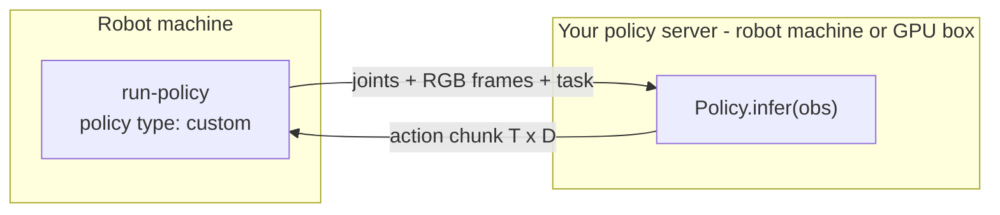

Run Policy can drive the arms with **your own model**, whatever framework it uses (JAX, a different torch version, a VLA served elsewhere, or a hand-written controller). You wrap the model in a small Python server with the [`almond_axol.policy`](/api/policy) SDK. The robot streams it joint state and camera frames, and executes the action chunks it returns.



Everything around the model is the same as for a LeRobot checkpoint: exposure-aligned observations, chunk ensembling, velocity/acceleration shaping, the collision-aware return to rest, contact stops, Save / Discard episode control and optional rollout recording to a LeRobot dataset.

## 1. Write the policy

Install `almond-axol` wherever the model runs. The base install is enough: the SDK needs only numpy and websockets, not LeRobot or torch. Then subclass `Policy`:

```python
# my_policy.py
import numpy as np

from almond_axol.policy import Observation, Policy, PolicySpec, serve


class MyPolicy(Policy):
    fps = 30  # optional: the robot refuses a different --fps

    def setup(self, spec: PolicySpec) -> None:
        # Called when the robot connects. spec.state_names / spec.action_names /
        # spec.cameras describe exactly what will be sent and expected.
        self.model = load_my_model(spec.policy_path)

    def reset(self) -> None:
        self.model.reset()  # called at the start of each episode

    def infer(self, obs: Observation) -> np.ndarray:
        # obs.state      float32, spec.state_names order (radians; gripper 0-1)
        # obs.images     {"overhead": (H, W, 3) uint8 RGB, ...}
        # obs.task       the task instruction
        return self.model.predict(obs.state, obs.images, obs.task)  # (T, D)


serve(MyPolicy(), host="127.0.0.1", port=8765)
```

`infer` returns `T` future targets, one row per control tick (`1 / fps` s apart), with columns in `spec.action_names` order. See [Action chunks](/api/policy#action-chunks) for the accepted shapes and [State and action names](/api/policy#state-and-action-names) for the layout. If you trained on a dataset from [Data Collection](/operations/data-collection), the names match its `observation.state` and `action` features.

Start it and leave it running:

```bash
python my_policy.py
```

<Tip>
  If the model runs **on the robot machine**, bind `127.0.0.1` as above; Run Policy connects there by default. If it runs **on a GPU machine**, bind its LAN IP (or `0.0.0.0`) and point Run Policy at it (below). The protocol is unauthenticated, so keep it on an isolated, trusted network and firewall the port so only the robot's IP can connect.
</Tip>

## 2. Run it

<Tabs>
  <Tab title="Control Panel">
    <Steps>
      <Step title="Assign cameras">
        Assign the cameras your model expects under **Axol settings → Cameras**, as for any policy. See [Cameras](/guides/control-panel#cameras).
      </Step>

      <Step title="Point at your server (remote only)">
        If the server isn't on the robot machine, set **Settings → Inference → Inference server host** (and **port**, if not `8765`) to its address and **Save**. Leave the host blank for a server on the robot machine.
      </Step>

      <Step title="Select Run Policy with policy type custom">
        Pick **Run Policy**, set **Policy type** to `custom`, and enter the **Task**. **Policy path** is optional here: whatever you type is passed to your server as `spec.policy_path`, e.g. to choose which checkpoint to load.
      </Step>

      <Step title="Start">
        Press **Start**. Run Policy connects to your server, checks the action layout, and returns the arms to rest. Then use **Start episode**, **Save** and **Discard** exactly as in [Run Policy](/operations/run-policy#run-it).
      </Step>
    </Steps>
  </Tab>

  <Tab title="CLI">
    ```bash
    axol run-policy \
        --policy_type custom \
        --task "Pick the red cube" \
        --robot_config.cameras "{overhead: {serial: 41234567}}"
    ```

    Add `--server_host 192.168.1.99` (and `--server_port`) when the server runs on another machine. `--policy_path` is optional and forwarded to your server. Episode keys (`s` / `r` / `q`) and every execution flag are as in [`run-policy`](/cli/run-policy).
  </Tab>
</Tabs>

## What's checked before the arms move

- **Action layout.** The robot sends its ordered action names. If your `Policy` sets `action_names`, they must match exactly, or the run stops before anything moves. This catches a joint-space model on a robot configured for Cartesian actions, or a model trained with grippers on the gripperless SKU. Every chunk's width is also checked against the layout.
- **Control rate.** If your `Policy` sets `fps` and it differs from `--fps`, the run is refused unless `--allow_fps_mismatch true`.
- **Your own checks.** `setup` sees the whole session (`spec.cameras`, `spec.state_names`, …). Raise to refuse, e.g. when a camera your model needs isn't assigned; the message is shown to the operator.

During a rollout, an exception in `infer`, a malformed chunk, a dropped connection, or a reply taking over 60 s stops the episode without saving it. The error is shown in the panel and the terminal.

## Next steps

<CardGroup cols={2}>
  <Card title="almond_axol.policy reference" icon="code" href="/api/policy">
    `Policy`, `Observation`, `PolicySpec`, `serve`, `PolicyClient`, and the wire protocol for non-Python models.
  </Card>
  <Card title="Run Policy" icon="play" href="/operations/run-policy">
    Episode control, contact stops, and execution smoothing, shared with LeRobot policies.
  </Card>
</CardGroup>
