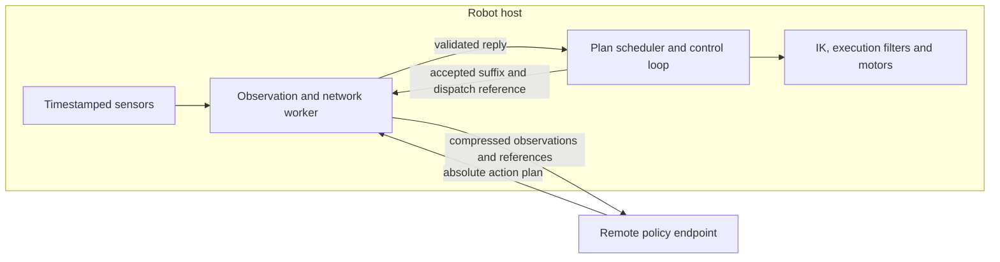

Run Policy and DAgger collection can drive the arms with **your own model**, whatever framework it uses (JAX, a different torch version, a VLA served elsewhere, or a hand-written controller). Wrap it in a small server with the [`almond_axol.policy`](/api/policy) SDK and select `--policy_type custom`. The robot streams it joint state and camera frames, and executes the action chunks it returns. The robot needs only the state/action layout, camera configuration and timing contract; it never loads the model.


```mermaid
flowchart LR
  subgraph robot [Robot host]
    sensors[Timestamped sensors]
    client[Observation and network worker]
    control[Plan scheduler and control loop]
    motors[IK, execution filters and motors]
    sensors --> client
    control -->|accepted suffix and dispatch reference| client
    control --> motors
  end
  endpoint[Remote policy endpoint]
  client -->|compressed observations and references| endpoint
  endpoint -->|absolute action plan| client
  client -->|validated reply| control
```

The endpoint (your server) owns preprocessing, inference, instruction selection,
postprocessing and any model-specific history or ensembling. The robot keeps
executing its accepted plan while inference runs, then adopts the new plan's
remaining rows at their original execution times. Network waits do not own
the motor loop. [Timing and continuity](/api/policy-plan#robot-control-loop)
explain the boundary contract and its limits.

## Write the policy

Install `almond-axol` wherever the model runs. The base install is enough; LeRobot and torch aren't needed. Subclass [`Policy`](/api/policy) and start it with `serve()`:

```python
# my_policy.py
import numpy as np

from almond_axol.policy import Observation, Policy, PolicySpec, serve


class MyPolicy(Policy):
    fps = 30  # optional: refuse a robot running at another rate

    def __init__(self, checkpoint: str, task: str) -> None:
        self.checkpoint, self.task = checkpoint, task

    def setup(self, spec: PolicySpec) -> None:
        # spec.state_names / spec.action_names / spec.cameras say exactly
        # what the robot will send and expect.
        self.model = load_my_model(self.checkpoint)

    def reset(self) -> None:
        self.model.reset()  # episode start, or the robot discarded its plan

    def infer(self, obs: Observation) -> np.ndarray:
        # obs.state   float32, spec.state_names order (radians; gripper 0-1)
        # obs.images  {"overhead": (H, W, 3) uint8 RGB, ...}
        # obs.plan    rows of the current plan still to run, or None
        return self.model.predict(obs.state, obs.images, self.task)  # (T, D)


serve(MyPolicy("myorg/my-model", "pick the red cube"), host="127.0.0.1", port=8765)
```

`infer` returns `T` future targets, one row per control tick, in `spec.action_names` order. See [Action chunks](/api/policy#action-chunks) for the accepted shapes and [State and action names](/api/policy#state-and-action-names) for the layout. If you trained on a dataset from [Data Collection](/operations/data-collection), the names match its `observation.state` and `action` features.

The robot executes each chunk exactly as published and switches to a new one at the row that's due when it arrives. To keep that hand-over smooth, use one of these:

- **Continue the motion in progress.** Condition on `obs.plan`, or at least start near `obs.plan[0]`.
- **Ensemble on the server.** Use `serve(..., ensemble=0.01)` for an ACT-style chunked policy trained with temporal ensembling.

`serve()` handles the rest of the [interface](/api/policy-plan): it echoes the session contract, caches published plans for continuation, clears them on reset, and relays exceptions to the operator. To implement the endpoint in another language, follow the [interface reference](/api/policy-plan) directly.

The model, checkpoint and instruction live in your policy. On the robot, `--task` only labels recorded episodes, and `--policy_path` is not used for custom policies.

## Check it without the robot

With the server running, play the robot's side of a session against it:

```bash
axol policy.check --delay_steps 3
```

[`policy.check`](/cli/policy-check) uses the robot's own scheduler on a virtual clock and simulates 3 ticks of reply latency. It reports late replies that would trigger recovery, the endpoint's round-trip time, and the largest jumps where one plan hands over to the next. Match `--cameras`, `--cartesian` and the chunk settings to your robot configuration. `check_policy()` does the same from Python, for unit tests.

## Run on the robot host

Replace the endpoint address and camera serial with your configuration:

```bash
axol run-policy --policy_type custom \
    --server_host 192.0.2.10 --server_port 8765 \
    --task "Pick the red cube" \
    --fps 30 --actions_per_chunk 30 \
    --robot_config.cameras "{overhead: {serial: 41234567}}"
```

The command connects to the endpoint; it does not spawn a model server.
Omitting `--server_host` connects to an endpoint already listening on
`127.0.0.1`. The robot and endpoint must agree on the selected camera, state
and action schemas before an episode can start.

In the control panel, assign cameras, select **Run Policy**, choose policy
type **custom**, and enter the task label. Configure the endpoint under
**Settings → Inference** and leave the policy path blank. The ordinary
episode controls and recording options remain available. See
[`run-policy`](/cli/run-policy) for the command's controls and settings.

Custom policies use `plan_config.request_interval` (default 5 rows) to schedule inference and `plan_config.max_adoption_offset_steps` (default 6) as the reply deadline.
The LeRobot `aggregate_fn`, `chunk_size_threshold`, temporal-ensemble and
chunk-alignment settings do not alter published custom-policy plans.
Ensembling belongs at the endpoint; downstream execution filtering remains
on the robot.

## Collect corrections with DAgger

```bash
axol collect-dagger --policy_type custom \
    --server_host 192.0.2.10 --server_port 8765 \
    --task "Pick the red cube" --repo_id myorg/policy-corrections \
    --hold_to_intervene true --record_joint_actions true \
    --home_on_start true --start_from_current_pose true \
    --robot_config.cameras "{overhead: {serial: 41234567}}"
```

Hold either grip to operate that arm; release both to request a fresh policy
plan. The robot holds the last operator command while waiting, then blends
back in joint space after IK. Background predictions can continue during
operator control, but they never command motors. Source changes retain the
same dataset episode and fence capture so intervention labels remain aligned.

DAgger has its own endpoint settings; its shared settings inherit from
`collect-data`, not the run-policy inference category. See
[`collect-dagger`](/cli/collect-dagger#remote-policies-through-the-custom-policy-interface)
for configuration, recording, startup homing and terminal soft shutdown.

## Failure behavior

A malformed reply, schema mismatch or transport failure stops the custom
policy path. Expired plans follow `plan_config.late_policy`: abort or hold
while obtaining fresh plans after a reset. The robot never retimes an expired
row to make it executable and does not automatically reconnect to resume
motion. See [Lifecycle and failure](/api/policy-plan#lifecycle-and-failure)
for the exact behavior and the distinction between a confirmed send and
physical tracking.
