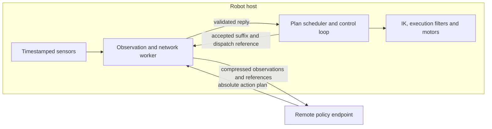

Select `--policy_type custom` to run a model through the
[custom policy interface](/api/policy-plan). This is the custom-policy path
for both autonomous execution and DAgger collection. The robot needs the
state/action layout, camera configuration and timing contract; it does not
load the model or choose its architecture.


```mermaid
flowchart LR
  subgraph robot [Robot host]
    sensors[Timestamped sensors]
    client[Observation and network worker]
    control[Plan scheduler and control loop]
    motors[IK, execution filters and motors]
    sensors --> client
    control -->|accepted suffix and dispatch reference| client
    control --> motors
  end
  endpoint[Remote policy endpoint]
  client -->|compressed observations and references| endpoint
  endpoint -->|absolute action plan| client
  client -->|validated reply| control
```

The endpoint owns preprocessing, inference, instruction selection,
postprocessing and any model-specific history or ensembling. The robot keeps
executing its accepted plan while inference runs, then adopts the new plan's
remaining rows at their original execution times. Network waits do not own
the motor loop. [Timing and continuity](/api/policy-plan#robot-control-loop)
explain the boundary contract and its limits.

## Endpoint requirements

Prepare an endpoint that implements the [wire contract](/api/policy-plan):

- Validate and echo the complete setup specification, including the ordered
  state/action names, prepared camera shapes, control rate and horizon.
- Accept PNG observations with their original sensor timestamps, and echo
  each request identifier in the action reply.
- Retain exact published plans so `continuation` and `last_dispatched` can
  identify different plans without losing history.
- Clear prediction and recurrent history on `reset`, acknowledge its episode
  number, and return absolute targets in the agreed units and robot frame.

The handshake uses `version: 2` to reject incompatible endpoints. The original
`Policy` / `serve()` SDK uses the earlier protocol and cannot serve current
robot commands unchanged. There is no protocol-selection flag or fallback.
This guide covers the robot client and endpoint requirements, not an endpoint
implementation.

Configure the model, checkpoint and instruction at the endpoint. On the robot,
`--task` supplies the dataset label. `--policy_path` is unused for custom
policies and is not sent to the endpoint.

## Run on the robot host

Replace the endpoint address and camera serial with your configuration:

```bash
axol run-policy --policy_type custom \
    --server_host 192.0.2.10 --server_port 8765 \
    --task "Pick the red cube" \
    --fps 30 --actions_per_chunk 30 \
    --plan_config.request_interval 10 \
    --plan_config.max_adoption_offset_steps 6 \
    --robot_config.cameras "{overhead: {serial: 41234567}}"
```

The command connects to the endpoint; it does not spawn a model server.
Omitting `--server_host` connects to an endpoint already listening on
`127.0.0.1`. The robot and endpoint must agree on the selected camera, state
and action schemas before an episode can start.

In the control panel, assign cameras, select **Run Policy**, choose policy
type **custom**, and enter the task label. Configure the endpoint under
**Settings → Inference** and leave the policy path blank. The ordinary
episode controls and recording options remain available. See
[`run-policy`](/cli/run-policy) for the command's controls and settings.

Custom policies use `plan_config.request_interval` to schedule inference.
The LeRobot `aggregate_fn`, `chunk_size_threshold`, temporal-ensemble and
chunk-alignment settings do not alter published custom-policy plans.
Ensembling belongs at the endpoint; downstream execution filtering remains
on the robot.

## Collect corrections with DAgger

```bash
axol collect-dagger --policy_type custom \
    --server_host 192.0.2.10 --server_port 8765 \
    --task "Pick the red cube" --repo_id myorg/policy-corrections \
    --hold_to_intervene true --record_joint_actions true \
    --home_on_start true --start_from_current_pose true \
    --robot_config.cameras "{overhead: {serial: 41234567}}"
```

Hold either grip to operate that arm; release both to request a fresh policy
plan. The robot holds the last operator command while waiting, then blends
back in joint space after IK. Background predictions can continue during
operator control, but they never command motors. Source changes retain the
same dataset episode and fence capture so intervention labels remain aligned.

DAgger has its own endpoint settings; its shared settings inherit from
`collect-data`, not the run-policy inference category. See
[`collect-dagger`](/cli/collect-dagger#remote-policies-through-the-custom-policy-interface)
for configuration, recording, startup homing and terminal soft shutdown.

## Failure behavior

A malformed reply, schema mismatch or transport failure stops the custom
policy path. Expired plans follow `plan_config.late_policy`: abort or hold
while obtaining fresh plans after a reset. The robot never retimes an expired
row to make it executable and does not automatically reconnect to resume
motion. See [Lifecycle and failure](/api/policy-plan#lifecycle-and-failure)
for the exact behavior and the distinction between a confirmed send and
physical tracking.
