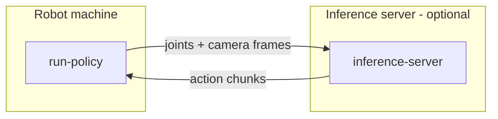

Run Policy executes a trained policy on the robot autonomously: it streams the robot's joint positions and camera frames to the policy, which returns action chunks that drive the arms. It runs on the same machine as [data collection](/operations/data-collection) — the computer wired to the robot with the three ZED cameras attached.

By default, inference runs **locally** on that machine. Optionally, it can be **offloaded to a more powerful machine** on the network (e.g. a desktop with a discrete GPU): the robot machine sends observations over gRPC and receives actions back.



You can launch a rollout from the **web control panel** or the **CLI** (`axol run-policy`).

## Before you start

- **Axol installed** ([one-command install](/installation)), CAN up, and motors verified.
- **The three ZED cameras connected**, with their serials on hand — see the [Data Collection](/operations/data-collection#before-you-start) tip for listing them.
- **A trained checkpoint** (local path or HuggingFace repo) and its policy type (`act`, `smolvla`, `pi0`, …). Use the **same** camera resolution, stereo setting, and fps the policy was trained on.
- **For local GPU inference**, the `cuda` extra — not included by the install script. Add it on a [development install](/advanced/development-install) with `uv sync --extra lerobot --extra cuda`, or offload to a remote server (below).

## Run it

<Tabs>
  <Tab title="Control Panel">
    

    <Steps>
      <Step title="Connect the robot and assign cameras">
        Connect the **Axol Host** and **Axol**, then assign the three cameras in the **Cameras** dialog. See [Cameras](/guides/control-panel#cameras).
      </Step>

      <Step title="Select Run Policy and fill the fields">
        Pick **Run Policy**. Set the **policy path** and **policy type**, the **task** description, and (to offload) a **server host**. Optional fields hold aggregation, chunking, and dataset-saving settings.
      </Step>

      <Step title="Start and control rollouts">
        Press **Start**, then use the **Episode control** box that appears:

        | Button | Effect |
        |---|---|
        | **Start episode** | Begin the next rollout. |
        | **Save** | Save the current episode and return to the reset gate. |
        | **Discard** | Drop the current episode and redo it. |

        To end the run, press **Stop** in the card header.
      </Step>
    </Steps>
  </Tab>

  <Tab title="CLI">
    On the robot machine:

    ```bash
    axol run-policy \
        --policy_path myorg/pick-place-policy \
        --policy_type act \
        --task "Pick the red cube" \
        --robot_config.cameras "{overhead: {serial: 41234567}, left_arm: {serial: 41234568}, right_arm: {serial: 41234569}}"
    ```

    A `PolicyServer` child process is launched on localhost; the parent streams observations to it and applies the returned action chunks. For CPU inference add `--device cpu`. Replace the serials with your cameras' (the `cameras` dict is one inline YAML value — see [Command configuration](/cli/configuration#field-name-conventions)).

    Control the rollout from stdin in the `run-policy` terminal:

    | Key | Action |
    |---|---|
    | `s` | Save the rollout and end the episode |
    | `r` | Discard and re-record |
    | `q` | Discard and quit |

    See [`run-policy`](/cli/run-policy) for aggregation, chunking, and dataset-saving fields.
  </Tab>
</Tabs>

`--episode_time_s` is a safety cap (default 120 s) that falls back to the same save / discard / quit prompt if no key is pressed. If a dataset repo is supplied, each saved episode is appended to a LeRobot-format dataset. Between episodes the arms return to the rest pose via a collision-aware IK trajectory.

## Offload inference to a remote server (optional)

<Steps>
  <Step title="Start the inference server on the GPU machine">
    The inference server runs on the GPU machine from the CLI — it isn't one of the control panel's operations. With the `lerobot` + `cuda` extras installed there:

    ```bash
    axol inference-server
    ```

    Listens on `0.0.0.0:8765` until `Ctrl+C`. See [`inference-server`](/cli/inference-server).
  </Step>

  <Step title="Point Run Policy at it">
    On the robot machine, run Run Policy exactly as above but pointed at the server's address:

    <Tabs>
      <Tab title="Control Panel">
        In the **Run Policy** form, open the **Optional** dropdown and set the **server host** field to the GPU machine's address (e.g. `192.168.1.99`), then press **Start**.
      </Tab>

      <Tab title="CLI">
        Add `--server_host`:

        ```bash
        axol run-policy \
            --policy_path myorg/pick-place-policy \
            --policy_type act \
            --task "Pick the red cube" \
            --server_host 192.168.1.99 \
            --robot_config.cameras "{overhead: {serial: 41234567}, left_arm: {serial: 41234568}, right_arm: {serial: 41234569}}"
        ```
      </Tab>
    </Tabs>

    The server downloads the policy itself, so `--policy_path` must be reachable from it (e.g. a HuggingFace Hub repo ID).
  </Step>
</Steps>

## Next steps

<CardGroup cols={2}>
  <Card title="Data Collection" icon="record-vinyl" href="/operations/data-collection">
    Record more episodes to improve the policy.
  </Card>
  <Card title="run-policy reference" icon="terminal" href="/cli/run-policy">
    Every flag, aggregation strategy, and threading detail.
  </Card>
</CardGroup>
