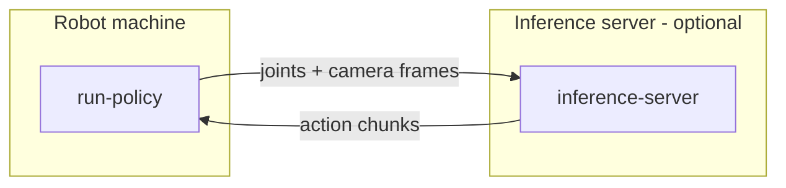

Run Policy executes a trained policy on the robot autonomously: it streams the robot's joint positions and camera frames to the policy, which returns action chunks that drive the arms. It runs on the same machine as [data collection](/operations/data-collection) — the computer wired to the robot with the ZED cameras attached.

By default, inference runs **locally** on that machine. Optionally, it can be **offloaded to a more powerful machine** on the network (e.g. a desktop with a discrete GPU): the robot machine sends observations over gRPC and receives actions back.


```mermaid
flowchart LR
  subgraph robot [Robot machine]
    proc["run-policy"]
  end
  subgraph server [Inference server - optional]
    infer["inference-server"]
  end
  proc -->|joints + camera frames| infer
  infer -->|action chunks| proc
```

You can launch a rollout from the **web control panel** or the **CLI** (`axol run-policy`).

<Note>
  Panel-saved rollouts go to the immutable hosted dataset boundary under
  `/var/lib/almond-axol/datasets`; non-root CLI rollouts use the normal user
  cache.
</Note>

## Before you start

- **Axol installed** ([one-command install](/installation)), CAN up, and motors verified.
- **The ZED cameras the policy was trained on connected** (at least one), with their serials on hand — see the [Data Collection](/operations/data-collection#before-you-start) tip for listing them.
- **A trained checkpoint** (local path or HuggingFace repo) and its policy type (`act`, `smolvla`, `pi0`, …). Assign the **same** cameras, and use the **same** camera resolution, stereo setting, and fps the policy was trained on.
- **For local GPU inference**, a CUDA-capable PyTorch install — or offload to a remote server (below). The hosted aarch64/Jetson install deliberately receives PyPI's CPU-only Torch 2.10 build; use an explicitly managed JetPack-compatible Torch + Torchvision build, select a remote server, or pass `--device cpu`. Axol's hosted updater will not overwrite an existing custom/CUDA build.

## Run it

<Tabs>
  <Tab title="Control Panel">
    <Steps>
      <Step title="Connect the robot and assign cameras">
        Connect the **Axol Host** and **Axol**, then assign the cameras the policy was trained on under **Axol Cameras** (at least one). See [Cameras](/guides/control-panel#cameras).
      </Step>

      <Step title="Select Run Policy and fill the fields">
        Pick **Run Policy**. Set the **policy path**, **policy type**, and **task** description — the per-run inputs. Remote inference (**server host**/port), aggregation, and chunking now live in the [Settings](/guides/control-panel#settings) **Inference** tab.
      </Step>

      <Step title="Start and control rollouts">
        Press **Start**, then use the **Episode control** box that appears:

        | Button | Effect |
        |---|---|
        | **Start episode** | Begin the next rollout. |
        | **Save** | Save the current episode and return to the reset gate. |
        | **Discard** | Drop the current episode. Because a failed rollout usually leaves the arms somewhere they shouldn't be, they go **limp** for hand-repositioning instead of driving home from that pose — clear them of the scene, then **Return to rest**. |
        | **Return to rest** | Send the limp arms home, replanning the collision-aware return from wherever they were left. Appears after a **Discard** (limp cleanup), when the guarded between-episode return meets resistance, or when the opt-in rollout [contact stop](/cli/run-policy) aborts an episode (a **Contact** hold). |

        To end the run, press **Stop** in the card header.
      </Step>
    </Steps>
  </Tab>

  <Tab title="CLI">
    On the robot machine:

    ```bash
    axol run-policy \
        --policy_path myorg/pick-place-policy \
        --policy_type act \
        --task "Pick the red cube" \
        --robot_config.cameras "{overhead: {serial: 41234567}, left_arm: {serial: 41234568}, right_arm: {serial: 41234569}}"
    ```

    A `PolicyServer` child process is launched on localhost; the parent streams observations to it and applies the returned action chunks. For CPU inference add `--device cpu`. Replace the serials with your cameras' — assign the same cameras the policy was trained on (at least one; omitted slots are dropped). The `cameras` dict is one inline YAML value — see [Command configuration](/cli/configuration#field-name-conventions).

    Control the rollout from stdin in the `run-policy` terminal:

    | Key | Action |
    |---|---|
    | `s` | Save the rollout and end the episode |
    | `r` | Discard the episode — the arms drop **limp** for hand-repositioning; clear them, then press **Enter** to return to rest and re-record |
    | `q` | Discard and quit |

    See [`run-policy`](/cli/run-policy) for aggregation, chunking, and dataset-saving fields.
  </Tab>
</Tabs>

`--episode_time_s` is a safety cap (default 120 s) that falls back to the same save / discard / quit prompt if no key is pressed. If a dataset repo is supplied, each saved episode is appended to a LeRobot-format dataset. Between episodes the arms return to the rest pose via a collision-aware IK trajectory — **guarded**: if a joint's torque strays from the gravity model for a sustained window (something still grasped, or a person grabbing an arm) the move stops where it is and the arms drop into a limp gravity-compensation hold. Free them by hand, then continue (Enter on the terminal, **Return to rest** on the control panel) to replan from wherever they were left. Tune with `--reset_torque_threshold` (default 4.0 Nm; `0` disables the watchdog) or the control panel's **Reset contact threshold**.

You can also arm a watchdog for the **rollout itself** — while the policy is driving the arms. It's **off by default** (a policy pushes on the scene on purpose): set `--policy_torque_threshold` (the control panel's **Policy contact stop**; suggested `16` Nm) and a sustained torque past the threshold **aborts the episode — nothing is saved** — and drops the arms limp. Clear them by hand, then continue (Enter / **Return to rest**) to return to rest and start the next attempt.

**Discarding** an episode uses that same limp hold up front: because a bad rollout usually leaves the arms somewhere they shouldn't be, they go slack for hand-repositioning first, so you untangle them by hand rather than dragging them home from a failed pose — then return to rest replans from where you left them.

<Info>
  Rollout execution stays smooth on any inference hardware. Every command the policy produces is shaped by the same velocity/acceleration profile teleop and all training data go through, so a slow or bursty inference platform decelerates the arms to a brief hold and ramps back out instead of jerking at chunk boundaries. The shaping knobs (`--exec_max_vel`, `--ensemble_blend_s`, `--align_fade_s`) are in the [`run-policy`](/cli/run-policy) reference.
</Info>

## Offload inference to a remote server (optional)

<Steps>
  <Step title="Start the inference server on the GPU machine">
    The inference server runs on the GPU machine from the CLI — it isn't one of the control panel's operations. With the `lerobot` extra installed there:

    ```bash
    axol inference-server --host 192.168.1.99
    ```

    Replace the example with the inference machine's exact LAN IP. The default is loopback-only; with `--host`, it listens on that interface's port `8765` until `Ctrl+C`. See [`inference-server`](/cli/inference-server).

    Use remote inference only across an isolated trusted network (or authenticated VPN), with a host firewall allowing the robot IP alone. Axol replaces LeRobot 0.6's pickle transport with bounded, versioned messages, but gRPC still has no TLS/client authentication: a peer can request checkpoint loads or impersonate the server and return arbitrary robot actions, so shared or untrusted networks remain unsafe.
  </Step>

  <Step title="Point Run Policy at it">
    On the robot machine, run Run Policy exactly as above but pointed at the server's address:

    <Tabs>
      <Tab title="Control Panel">
        In the [Settings](/guides/control-panel#settings) **Inference** tab, set the **server host** to the GPU machine's address (e.g. `192.168.1.99`) and **Save**, then press **Start** in the **Run Policy** panel.
      </Tab>

      <Tab title="CLI">
        Add `--server_host`:

        ```bash
        axol run-policy \
            --policy_path myorg/pick-place-policy \
            --policy_type act \
            --task "Pick the red cube" \
            --server_host 192.168.1.99 \
            --robot_config.cameras "{overhead: {serial: 41234567}, left_arm: {serial: 41234568}, right_arm: {serial: 41234569}}"
        ```
      </Tab>
    </Tabs>

    The server downloads the policy itself, so `--policy_path` must be reachable from it (e.g. a HuggingFace Hub repo ID).
  </Step>
</Steps>

## Next steps

<CardGroup cols={2}>
  <Card title="Data Collection" icon="record-vinyl" href="/operations/data-collection">
    Record more episodes to improve the policy.
  </Card>
  <Card title="run-policy reference" icon="terminal" href="/cli/run-policy">
    Every flag, aggregation strategy, and threading detail.
  </Card>
</CardGroup>
