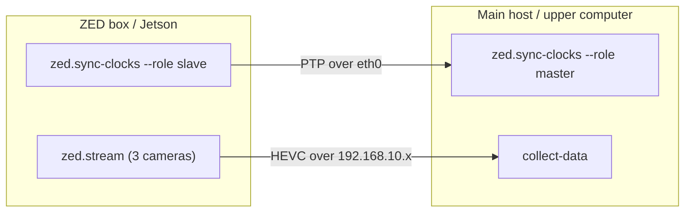

Data collection runs across **two machines** connected by a direct ethernet link:

- **Main host** (the upper computer) — owns the dataset, runs teleop and the recording loop.
- **ZED box** (the Jetson sender) — streams the three ZED-X One cameras.

Both machines must agree on the time (via PTP) so each recorded camera frame is aligned with the joint sample taken at the same instant. Each machine therefore runs **two long-lived processes**, each in its own terminal, that stay up for the entire session.



<Warning>
  Start the clock-sync daemon on **both** machines before launching `collect-data`. If PTP isn't running, the receiver's capture/decode skew check in `ZedCamera.connect()` warns and recorded camera/joint pairs will not be time-aligned. See [`zed.sync-clocks`](/cli/zed-sync-clocks) for the PTP canary details.
</Warning>

## Prerequisites

- The `lerobot` extra installed on the main host: `uv sync --extra lerobot` (see [Installation](/installation)).
- CAN set up on the main host ([`can.setup`](/cli/can-setup)) and motors verified ([`motor.info`](/cli/motor-info)).
- `pyzed` installed on the ZED box ([`zed.install`](/cli/zed-install)) and the three camera serial numbers on hand.
- A direct ethernet link between the two machines (e.g. `eth0` on each).

## ZED box (Jetson)

Open two terminals on the ZED box.

<Steps>
  <Step title="Start clock sync (slave)">
    ```bash
    axol zed.sync-clocks --role slave --iface eth0
    ```

    Leave this running for the whole session. See [`zed.sync-clocks`](/cli/zed-sync-clocks) for transport and timestamping options.
  </Step>

  <Step title="Stream the cameras">
    ```bash
    axol zed.stream \
        --overhead 12345678 \
        --left-arm 23456789 \
        --right-arm 34567890 \
        --setup-ip eth0
    ```

    `--setup-ip eth0` assigns the sender IP `192.168.10.1/24` to the link before streaming. Streams until `Ctrl+C`. See [`zed.stream`](/cli/zed-stream) for resolution, fps, and bitrate flags.
  </Step>
</Steps>

## Main host (upper computer)

Open two terminals on the main host.

<Steps>
  <Step title="Start clock sync (master)">
    ```bash
    axol zed.sync-clocks --role master --iface eth0
    ```

    The `master` role runs on the long-lived upper computer that owns the dataset. Leave it running for the whole session.
  </Step>

  <Step title="Run data collection">
    ```bash
    axol collect-data \
        --repo-id myorg/pick-place \
        --task "Pick the red cube and place it in the bin" \
        --zed-iface eth0
    ```

    `--zed-iface eth0` assigns the receiver IP `192.168.10.2/24` to the link. The robot is driven over VR (accept the TLS certificate first — see the [Teleoperation quickstart](/quickstart/teleop)). See [`collect-data`](/cli/collect-data) for the full flag list, including `--fps`, `--teleop-hz`, stiffness, and `--push-to-hub`.
  </Step>
</Steps>

## Recording episodes

Drive the robot from the VR headset and use the controller events to manage episodes:

| Event | Action |
|---|---|
| `START_RECORDING` | Begin capturing frames |
| `TERMINATE_EPISODE` | Save the episode; the headset shows `Saving` until the write completes |
| `RERECORD_EPISODE` | Discard and retry |

After each episode the robot automatically returns to its rest pose before the next take. Collection resumes from an existing dataset at `--root`; an aborted session that saved no episodes is cleaned up on shutdown. Press `Ctrl+C` in the `collect-data` terminal to finish.

## Next steps

<CardGroup cols={2}>
  <Card title="Policy Inference" icon="robot" href="/quickstart/inference">
    Run a trained policy autonomously across the same two machines.
  </Card>
  <Card title="collect-data reference" icon="terminal" href="/cli/collect-data">
    Every flag and the dataset capture internals.
  </Card>
</CardGroup>
