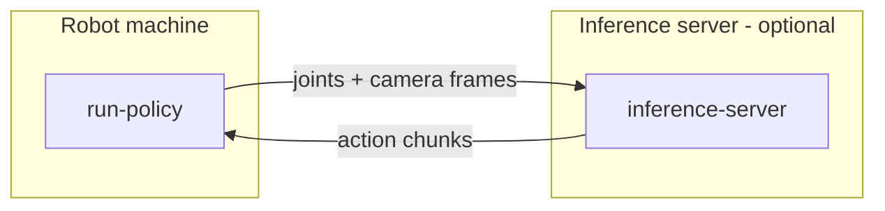

Policy inference runs on the same machine as [data collection](/quickstart/data-collection) — the computer wired to the robot with the three ZED cameras attached. By default, inference also runs there: `run-policy` spawns a local `PolicyServer` child process and streams observations to it.

Optionally, inference can be **offloaded to a more powerful machine** on the network (e.g. a desktop with a discrete GPU). The robot machine sends joint positions + camera frames over gRPC and receives action chunks back:



## Prerequisites

- The `lerobot` extra installed — the [quick install](/installation#quick-install-recommended) includes it. For local GPU inference the `cuda` extra is also needed, which the quick install does **not** include: on a development install run `uv sync --extra lerobot --extra cuda` (see [Installation](/installation)).
- A trained checkpoint (local path or HuggingFace repo) and its policy type (`act`, `smolvla`, `pi0`, …).
- CAN set up ([`can.setup`](/cli/can-setup)) and motors verified ([`motor.info`](/cli/motor-info)).
- `pyzed` installed ([`zed.install`](/cli/zed-install)) and the three ZED cameras connected, with their serial numbers on hand.

## Run the policy (local inference)

```bash
axol run-policy \
    --policy_path myorg/pick-place-policy \
    --policy_type act \
    --task "Pick the red cube" \
    --robot_config.cameras "{overhead: {serial: 41234567}, left_arm: {serial: 41234568}, right_arm: {serial: 41234569}}"
```

Replace the serials with your cameras' (the `cameras` dict is one inline YAML value — see [Command configuration](/cli/configuration#field-name-conventions)). Use the **same** camera resolution, stereo setting, and `--fps` the policy was trained on.

A `PolicyServer` child process is launched on localhost; the parent streams observations to it and applies the returned action chunks. For CPU inference add `--device cpu`. See [`run-policy`](/cli/run-policy) for aggregation, chunking, and dataset-saving fields, and [Command configuration](/cli/configuration) for the draccus override syntax.

## Offload inference to a remote server (optional)

<Steps>
  <Step title="Start the inference server">
    On the GPU machine (with the `lerobot` + `cuda` extras installed):

    ```bash
    axol inference-server
    ```

    Listens on `0.0.0.0:8765` until `Ctrl+C`. See [`inference-server`](/cli/inference-server).
  </Step>

  <Step title="Point run-policy at it">
    On the robot machine, add `--server_host`:

    ```bash
    axol run-policy \
        --policy_path myorg/pick-place-policy \
        --policy_type act \
        --task "Pick the red cube" \
        --server_host 192.168.1.99 \
        --robot_config.cameras "{overhead: {serial: 41234567}, left_arm: {serial: 41234568}, right_arm: {serial: 41234569}}"
    ```

    The server downloads the policy itself, so `--policy_path` must be reachable from it (e.g. a HuggingFace Hub repo ID).
  </Step>
</Steps>

## Controlling a rollout

While `run-policy` runs, control the episode from stdin in the `run-policy` terminal:

| Key | Action |
|---|---|
| `s` | Save the rollout and end the episode |
| `r` | Discard and re-record |
| `q` | Discard and quit |

`--episode_time_s` is a safety cap (default 120 s) that falls back to the same `[Enter]=save / r / q` prompt if no key is pressed. If `--repo_id` is supplied, each saved episode is appended to a LeRobot-format dataset. Between episodes the arms return to the rest pose via a collision-aware IK trajectory.

<Tip>
  The [web control panel](/guides/control-panel) exposes these same controls as **Start episode** / **Save** / **Discard** buttons, so you can run a policy and manage rollouts from a browser.
</Tip>

## Next steps

<CardGroup cols={2}>
  <Card title="Data Collection" icon="record-vinyl" href="/quickstart/data-collection">
    Record more episodes to improve the policy.
  </Card>
  <Card title="run-policy reference" icon="terminal" href="/cli/run-policy">
    Every flag, aggregation strategy, and threading detail.
  </Card>
</CardGroup>
