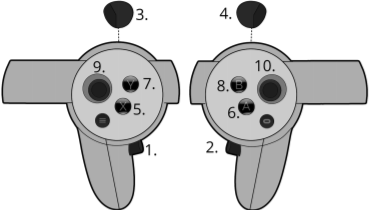

# Almond Axol Web

The browser front-ends for the Almond Axol robot. This directory lives inside the main `axol` repo (it was previously the standalone `axol-vr` repo) and builds three surfaces from one app:

- **VR interface** (`/vr`) — WebXR teleoperation. Streams hand/elbow pose from a Meta Quest headset to the Almond Axol SDK over WebSocket. Deployed to Vercel at [axol.almond.bot](https://axol.almond.bot).
- **Control panel** (`/control`) — browser UI for driving the robot (connect, teleop, gravity comp, collect data, run policy). Served by `axol serve`.
- **Diagnostics dashboard** (`/diagnostics`) — live motor telemetry (position / velocity / torque charts), per-motor health tiles, and diagnostics / calibration script runners with run history. Also served by `axol serve`.

The base path `/` redirects by device: headset browsers go to `/vr`, everything else to `/control` (the diagnostics dashboard is reached from the control panel's nav bar).

> Docs: [Web Control Panel](https://docs.almond.bot/guides/control-panel) · [Diagnostics Dashboard](https://docs.almond.bot/guides/diagnostics-dashboard) · [VR Interface](https://docs.almond.bot/guides/vr-interface). The `serve` backend (FastAPI) that the control panel and diagnostics dashboard talk to lives in `almond_axol/serve/`.

## Structure

```
web/
├── app/                        # Vite + React app — /vr, /control, and /diagnostics routes
│   ├── src/routes/VrApp.tsx        # WebXR teleop interface
│   ├── src/routes/ControlPanel.tsx # control panel UI
│   ├── src/routes/Diagnostics.tsx  # motor diagnostics dashboard
│   └── dist/                       # build output — served by `axol serve` and Vercel
└── packages/
    └── axol-vr-client/         # Reusable R3F components and hooks
```

## Packages

### `@almond/axol-vr-client`

React components and hooks for connecting to the Almond Axol SDK WebSocket server from inside an XR session.

**Exports**

| Export | Description |
|---|---|
| `AxolVRClient` | R3F component — reads XR input sources each frame and streams pose data over the main WebSocket, mirroring each frame onto a dedicated USB pose socket when supplied. Both copies share one producer id/sequence, so the first arrival wins and the other is discarded |
| `useAxolVRClient` | Hook — manages WebSocket lifecycle (connect, disconnect, auto-retry) |
| `useAxolPoseSocket` | Hook — maintains a dedicated pose WebSocket to `wss://localhost:<port>` (the Quest-over-USB `adb reverse` tunnel) so controller poses avoid WiFi latency; returns `{ poseWsRef, status }` |
| `useAxolVideo` | Hook — negotiates a WebRTC connection over the same WebSocket and returns the camera video tracks streamed by the server (overhead / wrist cams), labelled by camera name |
| `useAxolTracking` | Hook — returns a frame-readable `ref` reflecting whether the robot is currently engaged (mirroring the operator), driven by the server's `{"type":"tracking"}` pushes with a local grip-toggle fallback. Used to gate camera-screen repositioning to when the robot isn't being controlled |
| `useAxolJoints` | Hook — frame-readable `ref` of the server's ~20 Hz `{"type":"joints"}` pushes (URDF joint angles, grips, engaged flag, gripper-pair `aligned`/`width`); drives the **Ghost** overlay and the *(aligned)* cue |
| `useAxolSettings` | Hook — mirrors the server's **live session settings** (`{"type":"settings"}`: a schema plus current values) as React state and returns `setSetting(key, value)` / `step(def, ±1)`, which send `{"type":"set"}` on the socket. `nextSettingValue` / `formatSettingValue` are the generic stepper helpers both UIs share |
| `useAxolUrdfState` | Hook — returns a frame-readable `ref` with the latest `{"type":"urdf_state"}` push (robot base transform in the XR reference space + IK joint solution), used to render the virtual robot overlay in absolute (Mantis) mode |
| `AxolState` | Enum — `Teleop`, `DataCollection`, `Recording`, `Saving`, `Error` |
| `AxolConnectionStatus` | Enum — `Idle`, `Connecting`, `Open`, `Error`, `Failed` |
| `AxolPoseData` | Type — shape of each frame sent over the WebSocket |
| `AxolMode` | Type — `"teleop" \| "data_collection"`, the server-announced operating mode that locks the HUD |
| `AxolSettings` / `AxolSettingDef` | Types — the live-settings snapshot (`{ schema, values }`) and one schema entry (`key, label, type: "boolean" \| "select" \| "number", help, options, min, max, step, unit`) |
| `AxolJointState` | Type — one `joints` push (`q`, `l_grip`, `r_grip`, `engaged`, `pair`) |
| `AxolPoseMode` | Type — `"relative" \| "absolute"`, the independently announced controller-space convention |
| `ConfirmAction` | Type — `"save" \| "discard"`, which episode action a stop-recording confirmation popup is gating |
| `CameraStreams` | Type — `Record<string, MediaStream>`, the camera-name → stream map returned by `useAxolVideo` |

**`AxolVRClient` props**

| Prop | Type | Description |
|---|---|---|
| `wsRef` | `RefObject<WebSocket \| null>` | WebSocket ref from `useAxolVRClient` |
| `poseWsRef` | `RefObject<WebSocket \| null>` (optional) | Dedicated pose WebSocket from `useAxolPoseSocket` (Quest-over-USB). When open, each frame is sent over **both** transports with one producer id/sequence; the server accepts whichever copy arrives first, so USB normally wins on latency and WiFi takes over immediately if it stops |
| `onStateChange` | `(state: AxolState) => void` | Fires when the controller state machine transitions |
| `onPendingRecording` | `(pendingAt: number \| null) => void` | Fires with a timestamp when a 3-second recording countdown begins; `null` when cancelled or resolved |
| `onPendingConfirm` | `(action: ConfirmAction \| null) => void` | Fires with `"save"` / `"discard"` when the stop-recording confirmation popup is armed, and `null` when it's confirmed or cancelled |
| `onMode` | `(mode: AxolMode) => void` | Fires once per connection with the server-announced operating mode (`"teleop"` / `"data_collection"`) that locks the HUD |
| `onPoseMode` | `(mode: AxolPoseMode) => void` | Fires with the server-announced controller convention; defaults to legacy-safe `"relative"` while reconnecting |
| `onEpisode` | `(episode: number \| null) => void` | Fires with the current 1-based episode number during data collection (and `null` when the server clears it, e.g. on a connection change); drives the `Episode N` HUD readout |
| `onBothStickClick` | `() => void` | Fires on the rising edge of both thumbsticks clicked together (the two presses within 350 ms of each other), debounced to once per 600 ms — the controller shortcut for toggling box mode (the app sends `set box_mode "toggle"` via `useAxolSettings`) |
| `onExit` | `() => void` | Fires when the Y button exits the XR session |

**`useAxolVRClient` params**

```ts
useAxolVRClient(hostname: string, port = 8000, maxRetries = 3, retryMs = 1000)
// returns: { status, connect, disconnect, wsRef }
```

**`useAxolPoseSocket` params**

```ts
useAxolPoseSocket(enabled: boolean, port = 8000)
// returns: { poseWsRef, status }
```

When `enabled`, maintains `wss://localhost:<port>` — the Quest-over-USB
`adb reverse` tunnel — with auto-retry, and closes when disabled. Pass
`poseWsRef` to `AxolVRClient` and each frame is mirrored over both the USB cable
and network socket. Both copies carry the same stable `pose_source_id` and
`seq`; the server accepts the first arrival and globally discards the duplicate,
so USB normally wins on latency and WiFi takes over with no reconnect if the
cable drops. Camera video keeps using the LAN connection. See **Quest over USB**
in the repo README for the operator flow.

**Frame data (`AxolPoseData`)**

Each frame sends a JSON message over the WebSocket:

```ts
{
  l_ee:    { position: { x, y, z }, quaternion: { x, y, z, w } }  // left controller
  r_ee:    { position: { x, y, z }, quaternion: { x, y, z, w } }  // right controller
  l_elbow: { x, y, z }
  r_elbow: { x, y, z }
  l_lock:  boolean   // left grip button state (True = pressed); rising edge of both together enables tracking from rest, then each grip toggles (or, with hold_to_engage, holds) its own arm
  r_lock:  boolean   // right grip button state (True = pressed); see l_lock
  l_grip:  number    // left grip (0 = fully gripped, 1 = open)
  r_grip:  number    // right grip
  l_tracked: boolean // false when the left controller is only inertially tracked (WebXR emulatedPosition — occluded/out of view); the server holds the last clean pose. Omit to default true
  r_tracked: boolean // right controller optical-tracking state; see l_tracked
  l_pose_profile: string | null // first WebXR input profile; Quest mount calibration is scoped to this controller generation
  r_pose_profile: string | null
  l_pose_space: "grip" | "target-ray" // relative Axol keeps targetRaySpace; absolute Mantis uses calibrated gripSpace
  r_pose_space: "grip" | "target-ray"
  reset:   boolean   // true on the frame X (reset) or Y (exit) was pressed — Y piggy-backs a reset so the arms return to rest before the session ends
  state:   "teleop" | "data_collection" | "recording"  // client-driven; "saving" is server-pushed via feedback message
  l_stick_x: number  // left thumbstick x, [-1, 1], right = +1 — Jelly strafe (ignored without Jelly)
  l_stick_y: number  // left thumbstick y, [-1, 1], pushed forward = -1 — Jelly drive
  r_stick_x: number  // right thumbstick x, [-1, 1], right = +1 — Jelly rotation
  r_stick_y: number  // right thumbstick y, [-1, 1], pushed forward = -1 — box-mode tilt only (Jelly ignores it)
  l_stick_click: boolean  // left thumbstick pressed in — lift down while held
  r_stick_click: boolean  // right thumbstick pressed in — lift up while held (both together: box-mode toggle, sent as a `set` message)
  pose_source_id: string       // stable logical Quest id shared by USB, WebRTC, network, and reconnects
  pose_source_kind: "webxr"    // managed server source policy; Lighthouse/Ultimate bridges use "tracker"
  seq:     number    // monotonic within pose_source_id (including page reloads); the same frame is sent over both USB and WiFi with one seq, and the server accepts the first transport copy exactly once
}
```

The server admits only one logical pose producer. A managed Quest Mantis run accepts `webxr`; a managed Lighthouse/Ultimate run accepts `tracker`. Other connected clients still receive camera, HUD, and URDF messages, but their pose frames are view-only and cannot blend with or replace the selected source.

## Controller bindings



The operating mode (teleop vs. data collection) is **announced by the server on connect and locked** for the session — there's no in-headset toggle. In plain teleop the recording controls are inert; in data collection they drive episodes. The independent `{ "type": "pose_mode", "value": "relative" | "absolute" }` announcement selects the controller convention: relative Axol retains `targetRaySpace` and requires body elbows, while absolute/Mantis uses `gripSpace` and does not depend on elbow tracking. A client connected to an older server safely defaults to `relative`.

| # | Button | Action |
|---|---|---|
| 1 | Left grip | Press both grips (1 + 2) together to **enable** arm tracking from rest; once engaged each grip **toggles its own arm** — click to freeze that arm in place (e.g. while it holds something), click again to resume it. With the `hold_to_engage` setting the grips are dead-man switches instead: hold both to start, release one to freeze that arm, hold to keep it going |
| 2 | Right grip | See above |
| 3 | Left trigger | Actuate left gripper; while tracking is disengaged, point at a camera screen and hold to **move** it — grab one screen with **both** triggers to **resize** it |
| 4 | Right trigger | Actuate right gripper; while tracking is disengaged, point at a camera screen and hold to **move** it — grab one screen with **both** triggers to **resize** it |
| 5 | Left **X** | Reset pose; cancels a recording countdown. While recording, arms the **Discard episode?** confirmation — press **X** again to discard and re-record, or **A** to cancel and keep recording |
| 7 | Left **Y** | Exit the XR session — sends a reset first, so the arms return to rest and disengage instead of holding the last pose |
| 6 | Right **A** | **Record**: start a take (3-second countdown). While recording, arms the **Save episode?** confirmation — press **A** again to save, or **X** to cancel and keep recording — **data collection only** (no effect during plain teleop) |
| — | Right **B** | Re-anchor the camera screens to your current gaze and clear all moves + resizes |
| — | Left thumbstick | Drive Jelly: forward/back + strafe (robots fitted with Jelly only; deadman — the base stops when released) |
| — | Right thumbstick (x) | Rotate Jelly |
| — | Left thumbstick (click) | Lower the telescoping lift while held |
| — | Right thumbstick (click) | Raise the telescoping lift while held |
| — | Both thumbsticks (click together) | Toggle **box mode** (same as the HUD's **Box** button) |

### Re-engaging

Whenever an arm's grip re-engages after a pause — you froze it, walked away, or someone moved the arm by hand — the server has to reconcile where your controller is with where the arm is. The **Ramp** HUD toggle (or the **Re-engage** row of the session settings, below) picks one of two behaviours (the server owns it and echoes it back, like box mode; the control panel's **Re-engage** setting picks the startup default):

| Ramp | Behaviour |
|---|---|
| **OFF** — *clutch* (default) | The arm stays put and your controller's current pose becomes its new origin: **you match the arm**. Nothing moves at the grip; motion from there on is relative. Use the **Ghost** overlay (below) or the passthrough view of the real arm to bring your hand to roughly the arm's pose first if you want the same reach/comfort you had before |
| **ON** — *ramp* | The mapping from the arm's previous engage is kept as a session anchor and the arm **eases out to where your controller is now** under it — **the arm matches you** — then tracks 1:1. The move is paced (`reengage_ramp_speed`, at least `reengage_ramp_min_s`) and the target is live, so you can keep moving while it catches up. A reset / return to rest drops the anchor (the next grip snaps fresh); box mode ignores the toggle, since its engage already blends the pair into the parallel grasp |

The **Ghost** HUD button overlays a translucent copy of the robot (from the server's URDF) that follows the real joint state (green while engaged, grey otherwise), anchored to the floor in front of you at the robot's shoulder height, so the arms' true pose is visible through the passthrough while you line up a clutch engage.

### Box mode

Box mode is for carrying something with both hands: the grippers clamp the box between their sides like two flat hands — level, the fitted gripper's flat contact face along each side (the **Box tool** setting: the parcel gripper's folded blade, or the stock URDF gripper's finger side) — and **one grip drives both arms as a pair, by position and heading** (the pair stays level; turning the hand about vertical turns it about its centre). Toggle it with the **Box** HUD button, by clicking **both thumbsticks together** (within ~0.35 s of each other — a stick already held doesn't count; debounced so a quick double click toggles once), or from the control panel's session settings (or start sessions in it with the **Box mode at startup** setting in the control panel); the server owns the mode and echoes it back, so the HUD state is authoritative for every connected headset. The **Box** button reads **Box: OFF (aligned)** while the two grippers already point forward with a flat face toward each other across a box-sized gap (from the `pair` field of the `joints` push) — the moment switching costs no alignment blend. In box mode:

| Button | Action |
|---|---|
| Either grip | Press once to **engage** — the arms first blend into the parallel pair (keeping the current midpoint and width), then the pressed controller **leads**: its movement moves the pair as one body and turning it about vertical turns the pair about its centre (pitch and roll do nothing — the pair stays level). Press the *other* grip to hand over the lead to that controller; press the leading grip again to freeze. Press **X** to return to rest as usual |
| Leader's trigger | Actuates **both** grippers together |
| Either thumbstick ← → | Change the grip **width** — the distance between the two contact faces (push right = wider) — how you clamp the box |
| Either thumbstick ↑ ↓ | **Tilt** trim on top of the tool's flush yaw: pull back = fingertips inward, push forward = outward, pivoting about the contact face (the **Box** button shows the trim) |

Both sticks do the same, there are no click modifiers, and the sticks never move the pair — only the leading hand does; a stick's dominant axis alone counts, so width and tilt never change together. The thumbsticks belong to the arms only *while a grip is leading*: press the leader's grip again to **freeze** the pair (the arms hold the box where it is) and the sticks drive Jelly with the normal mapping — so carrying is grab, freeze, drive, lead again to adjust. The hand-over waits until both sticks are released, so a stick still held can't become base motion; squeeze the trigger before taking the lead back, since the grippers follow it. Leaving box mode (same gesture, or the **Box** button) disengages the arms; both grips together engage again as usual.

### Session settings

The HUD's **Settings** button opens a panel of **live session settings** — box mode, re-engage behaviour, hold-to-engage, grip force (hardware only), reach scale, arm speed — with `[-]` / `[+]` steppers. The same list appears as a **Session settings** card in the control panel next to the camera feeds. Both are rendered generically from the schema the server publishes (`{"type":"settings"}`) and change values with `{"type":"set","key","value"}` on the VR socket, so a change from either side shows up on both and the server's echo is the single source of truth (a rejected value never echoes). Adding a knob is one entry in `almond_axol/teleop/live.py`.

## State machine

In **teleop** mode the headset stays in `Teleop` with the recording controls inert. In **data collection** mode it starts in `DataCollection` and drives episodes with **A** / **X**:

```
DataCollection ──[A]──► (countdown 3s) ──► Recording
      ▲                                          │
      │                             [A]=save · [X]=discard
      │                            (arms a confirm popup — press
      │                             the same button again to commit)
      │                                          │
      ├──────── Saving ◄──(server push)◄─── [A→A] save
      │                                          │
      └────────────────────────────────── [X→X] discard
```

During the 3-second countdown the state sent to the server remains `DataCollection`. Once the countdown completes it transitions to `Recording`.

Stopping a recording is **confirmation-gated**: while recording, the first **A** (save) or **X** (discard) press arms an in-headset **Save episode?** / **Discard episode?** popup instead of stopping immediately. Pressing the **same** button confirms; the **other** cancels and keeps recording. Nothing is committed server-side until a save is confirmed — a confirmed discard carries the reset flag so the server drops the take and rewinds to re-record.

The `Saving` state is **server-driven**: the Python SDK broadcasts `{"type": "state", "value": "saving"}` over the WebSocket immediately when recording stops, then `{"type": "state", "value": "data_collection"}` once `save_episode()` completes. While in `Saving`, all A/X button actions except Y (exit) are blocked.

The `Error` state is also **server-driven**: broadcasting `{"type": "state", "value": "error"}` displays an error indicator in the headset UI and blocks all recording controls.

## App

The `app/` package is a Vite + React app that serves the WebXR teleop interface (`/vr`, wrapping the `axol-vr-client` library), the control panel (`/control`), and the motor diagnostics dashboard (`/diagnostics`). The routes are lazy-loaded so opening the control panel or diagnostics dashboard doesn't pull in the heavy three.js / XR bundle.

**Dev**

```bash
npm install
npm run dev --workspace=app
```

- **VR**: open the printed localhost URL on your Quest browser, enter the hostname of the machine running the Almond Axol SDK, press **Connect**, then **Start** to enter the AR session.
- **Control panel**: open `/control` in a normal browser. It talks to the `axol serve` API (default `https://localhost:8001`).

The control panel's operations aren't hardcoded here: `/api/commands` tells it which ones the connected host offers and what each needs (per-run fields, cameras, a sim flag, episode controls), so a host with extra operations registered — see `register()` in `almond_axol/serve/commands.py` — gets panels for them with no change to this app. A host predating that API answers without those fields, and the panel falls back to the built-in list in `app/src/lib/supervisor.ts` so an up-to-date panel still drives an older robot.

**Build**

```bash
npm run build --workspace=packages/axol-vr-client   # client package first
npm run build --workspace=app                        # → app/dist/
```

The built `app/dist/` is served two ways: by Vercel (the hosted VR app) and by `axol serve` locally (which hosts both routes from the same bundle).

## Deployment

The app is deployed on Vercel. `vercel.json` builds the client package first so it is available as a local workspace dependency:

```json
{
  "buildCommand": "npm run build --workspace=packages/axol-vr-client && npm run build --workspace=app",
  "outputDirectory": "app/dist",
  "installCommand": "rm -f package-lock.json && npm install"
}
```

The `installCommand` removes any macOS-generated lock file to avoid missing Linux rollup binaries on the Vercel build machine.

## Python SDK

The Almond Axol SDK receives frames from the headset and can push state feedback back. The relevant models live in `almond_axol/vr/models.py`:

```python
class VRState(str, Enum):
    TELEOP = "teleop"
    DATA_COLLECTION = "data_collection"
    RECORDING = "recording"
    SAVING = "saving"          # server-pushed only; blocks recording controls
    ERROR = "error"            # server-pushed only; shows error indicator in headset UI

class VRFrame(BaseModel):     # headset → server (every XR frame)
    l_ee: VRPose
    r_ee: VRPose
    l_elbow: VRPosition
    r_elbow: VRPosition
    l_lock: bool
    r_lock: bool
    l_grip: float
    r_grip: float
    reset: bool
    state: VRState             # one of TELEOP / DATA_COLLECTION / RECORDING
    l_stick_x: float = 0.0     # thumbstick + click fields drive the powered
    l_stick_y: float = 0.0     # Jelly (base + lift) when configured;
    r_stick_x: float = 0.0     # neutral defaults keep older web builds working
    r_stick_y: float = 0.0
    l_stick_click: bool = False
    r_stick_click: bool = False
    box_leader: Literal["left", "right"] | None = None  # server-internal (core → IK worker)
    reengage: Literal["clutch", "ramp"] | None = None   # server-internal (core → IK worker)
```

**Server → headset feedback**

The server can push a state override to all connected headsets at any time:

```json
{ "type": "state", "value": "saving" }
```

Use `AxolVRTeleop.send_feedback_state(VRState.SAVING)` / `send_feedback_state(VRState.DATA_COLLECTION)` to block and unblock recording controls on the headset while an episode is being written to disk.

On connect the server announces its operating mode — `{ "type": "mode", "value": "teleop" | "data_collection" }` (via `VRServer.set_mode()`) — which locks the headset HUD to that mode. During data collection it also pushes the current episode number — `{ "type": "episode", "value": N }` (1-based) — via `AxolVRTeleop.send_feedback_episode(episode)`, rendered as an `Episode N` HUD readout; the latest value is stored (`VRServer.set_episode()`) and re-sent on connect so a headset joining mid-session shows the right number.

The server also pushes `{ "type": "tracking", "value": true|false }` whenever the engage toggle changes; the headset uses it to only allow repositioning the camera screens while the robot isn't being controlled.

**Live settings** ride the same socket in both directions. Any client sends `{ "type": "set", "key": "<key>", "value": <value> }` — a boolean key also takes `"value": "toggle"`, flipped server-side, which is what the both-sticks gesture sends — (handled by the callback from `VRServer.set_on_setting()`, i.e. `almond_axol.teleop.live.LiveSettings.apply`); the server validates it and answers every request — including no-ops and from every client's point of view — with `{ "type": "settings", "value": { "schema": [...], "values": { ... } } }`, also sent on connect (`set_announce("settings", ...)`). `schema` entries are `{ key, label, type: "boolean"|"select"|"number", help, options, min, max, step, unit }`; the headset's Settings panel and the control panel's Session settings card render from it. Keys: `box_mode`, `box_tool` (`parcel` / `urdf`), `box_tool_open_deg`, `box_face_left` / `box_face_right` (`auto` / `+x` / `-x`), `reengage`, `hold_to_engage`, `gripper_torque` (hardware only), `position_multiplier`, `teleop_max_vel` (rev/s).

`{ "type": "joints", "value": { "q": { "<urdf joint name>": rad, ... }, "l_grip": 0..1, "r_grip": 0..1, "engaged": bool, "pair": { "aligned": bool, "width": m, "tilt": deg } | null } }` streams the commanded arm joint state at ~20 Hz (measured positions when the robot reports them); `useAxolJoints` collects it, the **Ghost** overlay poses a translucent copy of the URDF from it, and `pair.aligned` (the IK worker's check that the grippers already form the box-mode pair: level, the tool's contact face toward each other across a box-sized gap) drives the **Box** button's *(aligned)* cue; `pair.width` is the grip width between the contact faces and `pair.tilt` (the pair's inward tilt trim, set by the sticks in box mode) is the button's readout while the mode is on. The URDF and its meshes are served by the same VR server under `https://<host>:8000/urdf/` (`axol.urdf`, `meshes/*.stl`) so the overlay needs no second origin.
In absolute (Mantis) mode the server additionally streams `{ "type": "urdf_state", "base": { "pos": [x,y,z], "quat": [x,y,z,w] } | null, "joints": { "<urdf joint>": rad, ... }, "engaged": bool, "viewer_world_aligned": bool }` at ~30 Hz. `base` is the robot base transform solved at engage (null before the first engage) in the active pose producer's reference space; the app renders the robot URDF there (`RobotModel` in the app), fetching the model from the server's `https://<host>:8000/urdf/` static mount. A Quest connected during managed Lighthouse/Ultimate is view-only and has an unrelated local-floor origin/yaw, so these sources send `viewer_world_aligned: false` and the client hides the misleading spatial overlay unless an operator explicitly asserts an out-of-band world registration.

The server additionally **relays a HUD message between clients**: the headset publishes its transient HUD state — the armed save/discard confirmation popup and the record-start countdown — as `{ "type": "hud", "value": { "confirm": "save" | "discard" | null, "countdownRemainingMs": number | null } }`, and the server stores it and forwards it to every *other* connected client (re-sent to late joiners), clearing it with a null broadcast when the publisher disconnects. The control panel subscribes to this on its camera-feed socket to mirror the in-headset popups, so a session can be watched from the dashboard with the headset off.

**Camera video (WebRTC)**

When the server has video sources registered (`VRServer.set_video_sources`, see `almond_axol/video/video.py`), the headset negotiates a WebRTC connection over the same WebSocket: it sends `{ "type": "webrtc-request" }`, the server replies with `{ "type": "webrtc-offer", "sdp": ..., "tracks": { mid: cameraName } }`, and the client answers with `{ "type": "webrtc-answer", "sdp": ... }`. A request that arrives while the robot's cameras are still starting (they can take a while after the server begins accepting connections) is answered with `{ "type": "webrtc-pending" }` and the offer is pushed automatically once video comes up; a server with no video answers `{ "type": "webrtc-unavailable" }`. The `useAxolVideo` hook implements the client side — re-sending the request until an offer lands, so it also recovers against servers that predate `webrtc-pending` — and returns the labelled video tracks. A stereo overhead arrives as a single side-by-side track, `overhead_sbs` (both eyes packed into one stream — one decoder session on the headset), which the app renders per-lens through a WebXR media layer; the SDK-fallback path (no gst) instead sends the two per-eye tracks `overhead_left` / `overhead_right`.

The **control panel** joins the same `/ws` as one more **view-only** WebRTC client (`app/src/components/camera-feeds.tsx`, via `useAxolVideo`) to mirror these feeds in the panel — a headset-off operator view for headset-driven operations, with an optional fullscreen layout. There's no extra backend video path; the relay's encoders are shared. A side-by-side track is displayed cropped to its left eye, and a repeatedly-failing connection offers the same certificate-authorize flow the VR app uses.
